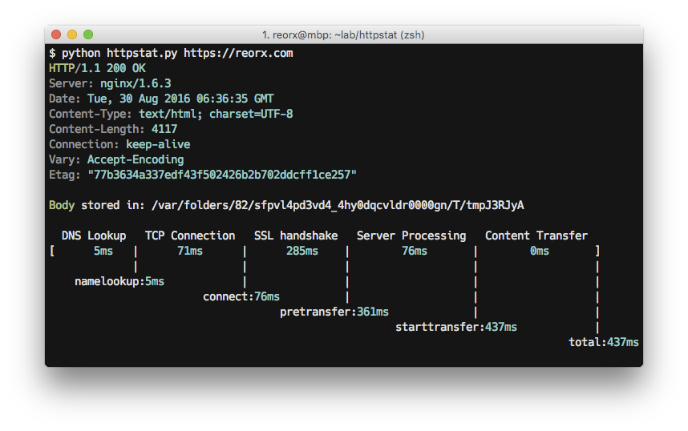

# httpstat



httpstat visualizes `curl(1)` statistics in a way of beauty and clarity.

It is a **single file🌟** Python script that has **no dependency👏** and is compatible with **Python 3🍻**.


## Installation

There are three ways to get `httpstat`:

- Download the script directly: `wget https://raw.githubusercontent.com/reorx/httpstat/master/httpstat.py`

- Install through pip: `pip install httpstat`

- Install through homebrew (macOS only): `brew install httpstat`


## Usage

Just pass a url with it:

```bash
python httpstat.py httpbin.org/get
```

> If installed through pip or brew, you can use `httpstat` as a command instead of `python httpstat.py`.

By default it will write response body in a tempfile, but you can let it print out by setting `HTTPSTAT_SHOW_BODY=true`:

```bash
HTTPSTAT_SHOW_BODY=true python httpstat.py httpbin.org/get
```

You can pass any curl supported arguments after the url (except for `-w`, `-D`, `-o`, `-s`, `-S` which are already used by httpstat):

```bash
HTTPSTAT_SHOW_BODY=true python httpstat.py httpbin.org/post -X POST --data-urlencode "a=中文" -v
```

## Related Projects

- [davecheney/httpstat](https://github.com/davecheney/httpstat)

  Written in pure Go, this one could run even if you don't have `curl(1)` or `python(1)`.
